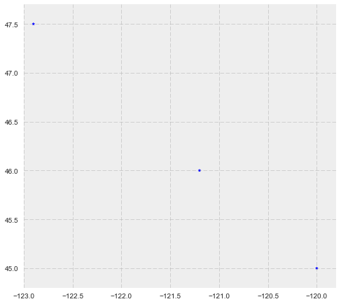
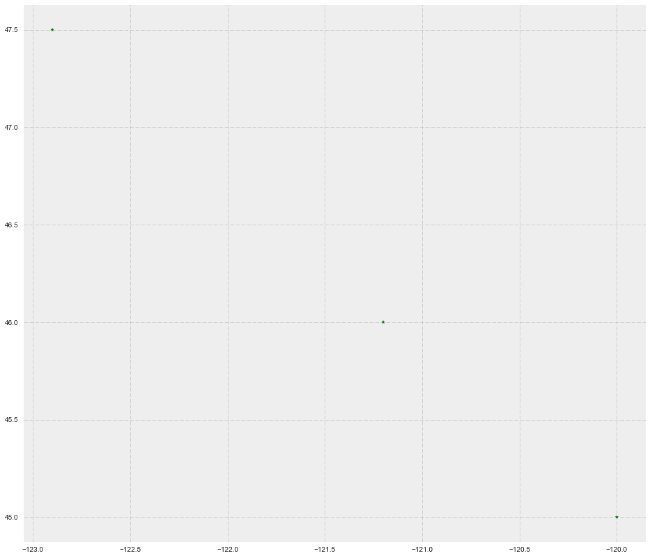
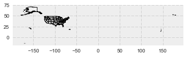
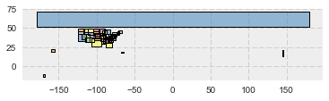
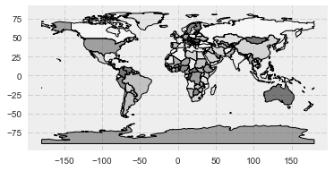
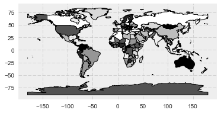
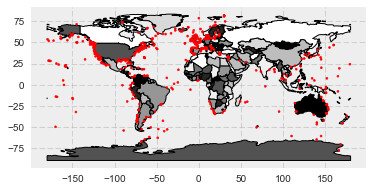

by Mark Conrad

based on the tutorial "GeoPandas Introduction" created by the eScience Institute 


```python

%matplotlib inline

import os

import matplotlib.pyplot as plt
# The two statemens below are used mainly to set up a plotting
# default style that's better than the default from matplotlib
import seaborn as sns
plt.style.use('bmh')

from shapely.geometry import Point
import pandas as pd
import geopandas as gpd
from geopandas import GeoSeries, GeoDataFrame


```


```python


from shapely.wkt import loads

GeoSeries([loads('POINT(1 2)'), loads('POINT(1.5 2.5)'), loads('POINT(2 3)')])
```


    0        POINT (1 2)
    1    POINT (1.5 2.5)
    2        POINT (2 3)
    dtype: object


```python
gs = GeoSeries([Point(-120, 45), Point(-121.2, 46), Point(-122.9, 47.5)])
gs
type(gs), len(gs)
```


    (geopandas.geoseries.GeoSeries, 3)


```python
gs.crs = {'init': 'epsg:4326'}

```


```python
gs.plot(marker = '*', color = 'blue', markersize = 14, figsize = (8,8))
plt.xlim([-123, -119.8])
plt.ylim([44.8,47.7])
```


    (44.8, 47.7)





```python
data = {'name':['a','b','c'], 'lat':[45,46,47.5], 'lon':[-120,-121.2,-122.9]}
```


```python
data

```


    {'lat': [45, 46, 47.5], 'lon': [-120, -121.2, -122.9], 'name': ['a', 'b', 'c']}


```python
data['lat']
```


    [45, 46, 47.5]


```python
geometry = [Point(xy) for xy in zip(data['lon'], data['lat'])]
geometry
```


    [<shapely.geometry.point.Point at 0x1135d5860>,
     <shapely.geometry.point.Point at 0x1135d5a90>,
     <shapely.geometry.point.Point at 0x1135d5048>]


```python
gs = GeoSeries(geometry, index=data['name'])
gs
```


    a        POINT (-120 45)
    b      POINT (-121.2 46)
    c    POINT (-122.9 47.5)
    dtype: object


```python
df = pd.DataFrame(data)
df
```


<div>
<table border="1" class="dataframe">
  <thead>
    <tr style="text-align: right;">
      <th></th>
      <th>lat</th>
      <th>lon</th>
      <th>name</th>
    </tr>
  </thead>
  <tbody>
    <tr>
      <th>0</th>
      <td>45.0</td>
      <td>-120.0</td>
      <td>a</td>
    </tr>
    <tr>
      <th>1</th>
      <td>46.0</td>
      <td>-121.2</td>
      <td>b</td>
    </tr>
    <tr>
      <th>2</th>
      <td>47.5</td>
      <td>-122.9</td>
      <td>c</td>
    </tr>
  </tbody>
</table>
</div>


```python
geometry = [Point(xy) for xy in zip(df['lon'], df['lat'])]
gdf = GeoDataFrame(df, geometry=geometry)
```


```python
gdf
```


<div>
<table border="1" class="dataframe">
  <thead>
    <tr style="text-align: right;">
      <th></th>
      <th>lat</th>
      <th>lon</th>
      <th>name</th>
      <th>geometry</th>
    </tr>
  </thead>
  <tbody>
    <tr>
      <th>0</th>
      <td>45.0</td>
      <td>-120.0</td>
      <td>a</td>
      <td>POINT (-120 45)</td>
    </tr>
    <tr>
      <th>1</th>
      <td>46.0</td>
      <td>-121.2</td>
      <td>b</td>
      <td>POINT (-121.2 46)</td>
    </tr>
    <tr>
      <th>2</th>
      <td>47.5</td>
      <td>-122.9</td>
      <td>c</td>
      <td>POINT (-122.9 47.5)</td>
    </tr>
  </tbody>
</table>
</div>


```python
gdf.plot(marker='*', color='green', markersize=20, figsize=(16, 16));
```





I took a shape file from the United States Census Bureau for tutorial purposes. 


```python

us_state = gpd.read_file("cb_2016_us_state_5m.shp")

#oceans = gpd.read_file(os.path.join(data_pth, "oceans.shp"))

```


```python
us_state.head()
```


<div>
<table border="1" class="dataframe">
  <thead>
    <tr style="text-align: right;">
      <th></th>
      <th>STATEFP</th>
      <th>STATENS</th>
      <th>AFFGEOID</th>
      <th>GEOID</th>
      <th>STUSPS</th>
      <th>NAME</th>
      <th>LSAD</th>
      <th>ALAND</th>
      <th>AWATER</th>
      <th>geometry</th>
    </tr>
  </thead>
  <tbody>
    <tr>
      <th>0</th>
      <td>01</td>
      <td>01779775</td>
      <td>0400000US01</td>
      <td>01</td>
      <td>AL</td>
      <td>Alabama</td>
      <td>00</td>
      <td>131173688951</td>
      <td>4593686489</td>
      <td>(POLYGON ((-88.04374299999999 30.517423, -88.0...</td>
    </tr>
    <tr>
      <th>1</th>
      <td>02</td>
      <td>01785533</td>
      <td>0400000US02</td>
      <td>02</td>
      <td>AK</td>
      <td>Alaska</td>
      <td>00</td>
      <td>1477946266785</td>
      <td>245390495931</td>
      <td>(POLYGON ((-133.655819 55.625617, -133.624921 ...</td>
    </tr>
    <tr>
      <th>2</th>
      <td>04</td>
      <td>01779777</td>
      <td>0400000US04</td>
      <td>04</td>
      <td>AZ</td>
      <td>Arizona</td>
      <td>00</td>
      <td>294198560125</td>
      <td>1027346486</td>
      <td>POLYGON ((-114.799683 32.593621, -114.809393 3...</td>
    </tr>
    <tr>
      <th>3</th>
      <td>08</td>
      <td>01779779</td>
      <td>0400000US08</td>
      <td>08</td>
      <td>CO</td>
      <td>Colorado</td>
      <td>00</td>
      <td>268429343790</td>
      <td>1175112870</td>
      <td>POLYGON ((-109.060253 38.599328, -109.059541 3...</td>
    </tr>
    <tr>
      <th>4</th>
      <td>09</td>
      <td>01779780</td>
      <td>0400000US09</td>
      <td>09</td>
      <td>CT</td>
      <td>Connecticut</td>
      <td>00</td>
      <td>12542638347</td>
      <td>1815476291</td>
      <td>POLYGON ((-73.72777499999999 41.100696, -73.69...</td>
    </tr>
  </tbody>
</table>
</div>


```python
us_state.crs

```


    {'init': 'epsg:4269'}


```python
us_state.plot()
```


    <matplotlib.axes._subplots.AxesSubplot at 0x11378f080>





```python
us_state.geom_type
```


    0     MultiPolygon
    1     MultiPolygon
    2          Polygon
    3          Polygon
    4          Polygon
    5     MultiPolygon
    6          Polygon
    7          Polygon
    8          Polygon
    9          Polygon
    10    MultiPolygon
    11    MultiPolygon
    12         Polygon
    13         Polygon
    14         Polygon
    15         Polygon
    16         Polygon
    17    MultiPolygon
    18         Polygon
    19         Polygon
    20         Polygon
    21         Polygon
    22         Polygon
    23         Polygon
    24         Polygon
    25         Polygon
    26    MultiPolygon
    27         Polygon
    28    MultiPolygon
    29    MultiPolygon
    30         Polygon
    31    MultiPolygon
    32         Polygon
    33         Polygon
    34    MultiPolygon
    35    MultiPolygon
    36    MultiPolygon
    37    MultiPolygon
    38    MultiPolygon
    39         Polygon
    40         Polygon
    41         Polygon
    42    MultiPolygon
    43    MultiPolygon
    44         Polygon
    45    MultiPolygon
    46         Polygon
    47         Polygon
    48    MultiPolygon
    49    MultiPolygon
    50    MultiPolygon
    51    MultiPolygon
    52    MultiPolygon
    53    MultiPolygon
    54    MultiPolygon
    55         Polygon
    dtype: object


```python
us_state.geometry.bounds
```


<div>
<table border="1" class="dataframe">
  <thead>
    <tr style="text-align: right;">
      <th></th>
      <th>minx</th>
      <th>miny</th>
      <th>maxx</th>
      <th>maxy</th>
    </tr>
  </thead>
  <tbody>
    <tr>
      <th>0</th>
      <td>-88.473227</td>
      <td>30.221132</td>
      <td>-84.891841</td>
      <td>35.008028</td>
    </tr>
    <tr>
      <th>1</th>
      <td>-179.147340</td>
      <td>51.219862</td>
      <td>179.778470</td>
      <td>71.352561</td>
    </tr>
    <tr>
      <th>2</th>
      <td>-114.814185</td>
      <td>31.332177</td>
      <td>-109.045223</td>
      <td>37.004260</td>
    </tr>
    <tr>
      <th>3</th>
      <td>-109.060253</td>
      <td>36.992426</td>
      <td>-102.041524</td>
      <td>41.003444</td>
    </tr>
    <tr>
      <th>4</th>
      <td>-73.727775</td>
      <td>40.985171</td>
      <td>-71.786994</td>
      <td>42.050587</td>
    </tr>
    <tr>
      <th>5</th>
      <td>-87.634943</td>
      <td>24.514962</td>
      <td>-80.031362</td>
      <td>31.000886</td>
    </tr>
    <tr>
      <th>6</th>
      <td>-85.605165</td>
      <td>30.357836</td>
      <td>-80.840549</td>
      <td>35.000659</td>
    </tr>
    <tr>
      <th>7</th>
      <td>-117.243027</td>
      <td>41.988057</td>
      <td>-111.043564</td>
      <td>49.001146</td>
    </tr>
    <tr>
      <th>8</th>
      <td>-88.097892</td>
      <td>37.771742</td>
      <td>-84.784579</td>
      <td>41.760592</td>
    </tr>
    <tr>
      <th>9</th>
      <td>-102.051744</td>
      <td>36.993083</td>
      <td>-94.589933</td>
      <td>40.003162</td>
    </tr>
    <tr>
      <th>10</th>
      <td>-94.043147</td>
      <td>28.929709</td>
      <td>-88.817017</td>
      <td>33.019457</td>
    </tr>
    <tr>
      <th>11</th>
      <td>-73.508142</td>
      <td>41.237964</td>
      <td>-69.928261</td>
      <td>42.886589</td>
    </tr>
    <tr>
      <th>12</th>
      <td>-97.239209</td>
      <td>43.499356</td>
      <td>-89.489226</td>
      <td>49.384358</td>
    </tr>
    <tr>
      <th>13</th>
      <td>-95.774704</td>
      <td>35.995683</td>
      <td>-89.098843</td>
      <td>40.613640</td>
    </tr>
    <tr>
      <th>14</th>
      <td>-116.050003</td>
      <td>44.358221</td>
      <td>-104.039138</td>
      <td>49.001390</td>
    </tr>
    <tr>
      <th>15</th>
      <td>-120.005746</td>
      <td>35.001857</td>
      <td>-114.039648</td>
      <td>42.002207</td>
    </tr>
    <tr>
      <th>16</th>
      <td>-75.559614</td>
      <td>38.928519</td>
      <td>-73.893979</td>
      <td>41.357423</td>
    </tr>
    <tr>
      <th>17</th>
      <td>-79.762152</td>
      <td>40.496103</td>
      <td>-71.856214</td>
      <td>45.015850</td>
    </tr>
    <tr>
      <th>18</th>
      <td>-104.048900</td>
      <td>45.935054</td>
      <td>-96.554507</td>
      <td>49.000687</td>
    </tr>
    <tr>
      <th>19</th>
      <td>-103.002565</td>
      <td>33.616567</td>
      <td>-94.431215</td>
      <td>37.002206</td>
    </tr>
    <tr>
      <th>20</th>
      <td>-80.519891</td>
      <td>39.720062</td>
      <td>-74.689516</td>
      <td>42.269860</td>
    </tr>
    <tr>
      <th>21</th>
      <td>-83.353238</td>
      <td>32.034600</td>
      <td>-78.541087</td>
      <td>35.215402</td>
    </tr>
    <tr>
      <th>22</th>
      <td>-104.057698</td>
      <td>42.479635</td>
      <td>-96.436589</td>
      <td>45.945450</td>
    </tr>
    <tr>
      <th>23</th>
      <td>-106.645646</td>
      <td>25.837377</td>
      <td>-93.516407</td>
      <td>36.500704</td>
    </tr>
    <tr>
      <th>24</th>
      <td>-73.437740</td>
      <td>42.726853</td>
      <td>-71.465039</td>
      <td>45.016659</td>
    </tr>
    <tr>
      <th>25</th>
      <td>-82.644739</td>
      <td>37.201483</td>
      <td>-77.719519</td>
      <td>40.638801</td>
    </tr>
    <tr>
      <th>26</th>
      <td>-67.940799</td>
      <td>17.878309</td>
      <td>-65.221568</td>
      <td>18.515757</td>
    </tr>
    <tr>
      <th>27</th>
      <td>-94.617919</td>
      <td>33.004106</td>
      <td>-89.644838</td>
      <td>36.499600</td>
    </tr>
    <tr>
      <th>28</th>
      <td>-124.409591</td>
      <td>32.534156</td>
      <td>-114.134427</td>
      <td>42.009518</td>
    </tr>
    <tr>
      <th>29</th>
      <td>-75.788895</td>
      <td>38.451012</td>
      <td>-75.048939</td>
      <td>39.839185</td>
    </tr>
    <tr>
      <th>30</th>
      <td>-77.119759</td>
      <td>38.791645</td>
      <td>-76.909393</td>
      <td>38.995548</td>
    </tr>
    <tr>
      <th>31</th>
      <td>-160.249610</td>
      <td>18.917466</td>
      <td>-154.809379</td>
      <td>22.232603</td>
    </tr>
    <tr>
      <th>32</th>
      <td>-91.513079</td>
      <td>36.970298</td>
      <td>-87.496494</td>
      <td>42.508481</td>
    </tr>
    <tr>
      <th>33</th>
      <td>-96.639704</td>
      <td>40.378264</td>
      <td>-90.140061</td>
      <td>43.501196</td>
    </tr>
    <tr>
      <th>34</th>
      <td>-89.571509</td>
      <td>36.497129</td>
      <td>-81.964971</td>
      <td>39.147458</td>
    </tr>
    <tr>
      <th>35</th>
      <td>-71.083924</td>
      <td>43.059825</td>
      <td>-66.949895</td>
      <td>47.459686</td>
    </tr>
    <tr>
      <th>36</th>
      <td>-79.487651</td>
      <td>37.911717</td>
      <td>-75.048939</td>
      <td>39.723122</td>
    </tr>
    <tr>
      <th>37</th>
      <td>-90.418136</td>
      <td>41.696089</td>
      <td>-82.412965</td>
      <td>48.190975</td>
    </tr>
    <tr>
      <th>38</th>
      <td>-91.655009</td>
      <td>30.173943</td>
      <td>-88.097888</td>
      <td>34.996052</td>
    </tr>
    <tr>
      <th>39</th>
      <td>-104.053514</td>
      <td>39.999998</td>
      <td>-95.308290</td>
      <td>43.001708</td>
    </tr>
    <tr>
      <th>40</th>
      <td>-72.557247</td>
      <td>42.696990</td>
      <td>-70.703799</td>
      <td>45.305476</td>
    </tr>
    <tr>
      <th>41</th>
      <td>-109.050173</td>
      <td>31.332301</td>
      <td>-103.001964</td>
      <td>37.000232</td>
    </tr>
    <tr>
      <th>42</th>
      <td>-84.321869</td>
      <td>33.844517</td>
      <td>-75.458659</td>
      <td>36.588117</td>
    </tr>
    <tr>
      <th>43</th>
      <td>-84.820159</td>
      <td>38.403202</td>
      <td>-80.518693</td>
      <td>41.977523</td>
    </tr>
    <tr>
      <th>44</th>
      <td>-124.552441</td>
      <td>41.991794</td>
      <td>-116.463504</td>
      <td>46.271004</td>
    </tr>
    <tr>
      <th>45</th>
      <td>-71.862772</td>
      <td>41.146339</td>
      <td>-71.120570</td>
      <td>42.018798</td>
    </tr>
    <tr>
      <th>46</th>
      <td>-90.310298</td>
      <td>34.982972</td>
      <td>-81.646900</td>
      <td>36.678118</td>
    </tr>
    <tr>
      <th>47</th>
      <td>-114.052962</td>
      <td>36.997968</td>
      <td>-109.041058</td>
      <td>42.001567</td>
    </tr>
    <tr>
      <th>48</th>
      <td>-83.675413</td>
      <td>36.540738</td>
      <td>-75.242266</td>
      <td>39.466012</td>
    </tr>
    <tr>
      <th>49</th>
      <td>-124.733174</td>
      <td>45.543541</td>
      <td>-116.915989</td>
      <td>49.002494</td>
    </tr>
    <tr>
      <th>50</th>
      <td>-92.888114</td>
      <td>42.491920</td>
      <td>-86.805415</td>
      <td>47.077570</td>
    </tr>
    <tr>
      <th>51</th>
      <td>-171.089830</td>
      <td>-14.552549</td>
      <td>-168.139729</td>
      <td>-11.046934</td>
    </tr>
    <tr>
      <th>52</th>
      <td>144.618331</td>
      <td>13.230492</td>
      <td>144.958717</td>
      <td>13.653518</td>
    </tr>
    <tr>
      <th>53</th>
      <td>144.884687</td>
      <td>14.110571</td>
      <td>146.081586</td>
      <td>20.557251</td>
    </tr>
    <tr>
      <th>54</th>
      <td>-65.085361</td>
      <td>17.674091</td>
      <td>-64.566547</td>
      <td>18.413486</td>
    </tr>
    <tr>
      <th>55</th>
      <td>-111.056888</td>
      <td>40.994746</td>
      <td>-104.052160</td>
      <td>45.005904</td>
    </tr>
  </tbody>
</table>
</div>


```python
us_state.envelope.plot();
```





```python
world = gpd.read_file(gpd.datasets.get_path('naturalearth_lowres'))
```


```python
world.head()
```


<div>
<table border="1" class="dataframe">
  <thead>
    <tr style="text-align: right;">
      <th></th>
      <th>pop_est</th>
      <th>continent</th>
      <th>name</th>
      <th>iso_a3</th>
      <th>gdp_md_est</th>
      <th>geometry</th>
    </tr>
  </thead>
  <tbody>
    <tr>
      <th>0</th>
      <td>28400000.0</td>
      <td>Asia</td>
      <td>Afghanistan</td>
      <td>AFG</td>
      <td>22270.0</td>
      <td>POLYGON ((61.21081709172574 35.65007233330923,...</td>
    </tr>
    <tr>
      <th>1</th>
      <td>12799293.0</td>
      <td>Africa</td>
      <td>Angola</td>
      <td>AGO</td>
      <td>110300.0</td>
      <td>(POLYGON ((16.32652835456705 -5.87747039146621...</td>
    </tr>
    <tr>
      <th>2</th>
      <td>3639453.0</td>
      <td>Europe</td>
      <td>Albania</td>
      <td>ALB</td>
      <td>21810.0</td>
      <td>POLYGON ((20.59024743010491 41.85540416113361,...</td>
    </tr>
    <tr>
      <th>3</th>
      <td>4798491.0</td>
      <td>Asia</td>
      <td>United Arab Emirates</td>
      <td>ARE</td>
      <td>184300.0</td>
      <td>POLYGON ((51.57951867046327 24.24549713795111,...</td>
    </tr>
    <tr>
      <th>4</th>
      <td>40913584.0</td>
      <td>South America</td>
      <td>Argentina</td>
      <td>ARG</td>
      <td>573900.0</td>
      <td>(POLYGON ((-65.50000000000003 -55.199999999999...</td>
    </tr>
  </tbody>
</table>
</div>


```python
world.plot()
```


    <matplotlib.axes._subplots.AxesSubplot at 0x11371c208>





```python
world.plot(ax= us_state.plot(cmap='Set2', alpha = 1), alpha = 1)
```


    <matplotlib.axes._subplots.AxesSubplot at 0x113438dd8>





 FYI there are other nice categorical color maps (cmap) these include 'Set2' and 'Set1'


```python
import json
import psycopg2
```

## Read from Open Geospatial Consortium Web Feature Services GeoJSON response into a GeoDataFrame. 
Here I will use an OGC WFS request to obtain geospatial data from a remote source. OGC WFS is an open geospatial standard. We issue an OGC WFS request for all features from the layer named "oa:goainv" found in a GeoServer instance from NANOOS, requesting the response in GeoJSON format. We load it into a geojson feature object with the geojson package.
The "oa:goainv" layer is a global dataset of monitoring sites and cruises where data relevant to ocean acidification is collected. 


```python
import requests
import geojson

wfs_url = "http://data.nanoos.org/geoserver/ows"
params = dict(service='WFS', version='1.0.0', request='GetFeature',
              typeName='oa:goaoninv', outputFormat='json')

r = requests.get(wfs_url, params=params)
wfs_geo = geojson.loads(r.content)
```

Now let's examine the general characteristics of this GeoJSON object. We'll take advantage of the ___geo_interface   interface discussed earlier.


```python
print(type(wfs_geo))
print(wfs_geo.keys())
print(len(wfs_geo.__geo_interface__['features']))
```

    <class 'geojson.feature.FeatureCollection'>
    dict_keys(['type', 'totalFeatures', 'crs', 'features'])
    544


Now we are going to use the from_feature constructor method to create a GeoDataFrame, passing to it the feature from the __geo_interface__ method.


```python
wfs_gdf = GeoDataFrame.from_features(wfs_geo.__geo_interface__['features'])


```


    Oceans                                                    North Atlantic Ocean
    additional_organizations                                                      
    agency                                                                        
    city                                                                          
    comments                                                                      
    comments_about_overlaps                                                       
    contact_email                     akoertzinger@geomar.de; tsteinhoff@geomar.de
    contact_name                                  Arne Körtzinger;Tobias Steinhoff
    country                                                                Germany
    data_url                                                 http://www.socat.info
    department                                                                    
    deploy_date                                                                   
    depth_range                                                                   
    duration                                                                      
    frequency                                           1 crossing every 2.5 weeks
    geometry                                                  POINT (-53.53 46.27)
    id                                                                         589
    latitude                                                                 46.27
    line_xy                      -53.53,46.27::-53.28,46.33::-53.03,46.38::-52....
    location                                                                      
    longitude                                                               -53.53
    method                                                                        
    method_documentation         Carbon system including CO2 fluxes in the Nort...
    organization                   GEOMAR Helmholtz Centre for Ocean Research Kiel
    organization_abbreviation                                               GEOMAR
    overlaps_with                                                                 
    parameters                       pCO2; dissolved oxygen; salinity; temperature
    parameters_planned                                                            
    platform_name                                                           GEOMAR
    platform_name_kml                                                      589.kml
    platform_type                                                              VOS
    point_xy                                                          -53.53,46.27
    project                                                                       
    sensors                                                                       
    source_doc                                                     on-line request
    track_pt_lat                                                             46.27
    track_pt_lon                                                            -53.53
    type                                                                open ocean
    url                             http://www.geomar.de/en/research/expeditionen/
    Name: 543, dtype: object


Now we display the values for the last feature, as an example.


```python
wfs_gdf.iloc[-1]

wfs_gdf.plot(ax=world.plot(alpha=1), figsize=(10, 6),
             marker='o', color='red', markersize=4);
```





## In Summation, 
In this tutorial created by the eScience Institute, we saw that GeoPandas draws its power and simplicity from leveraging Pandas and core geospatial libraries.
